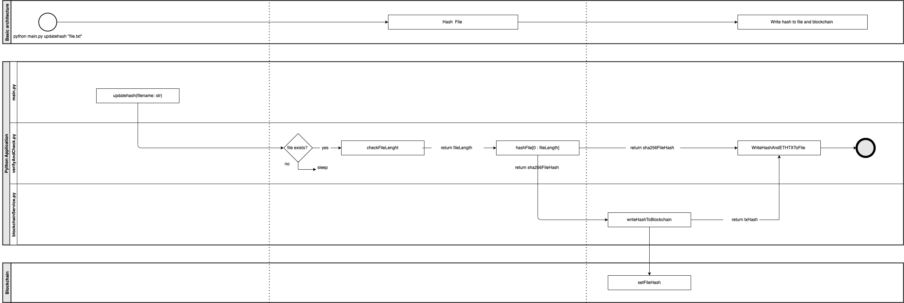
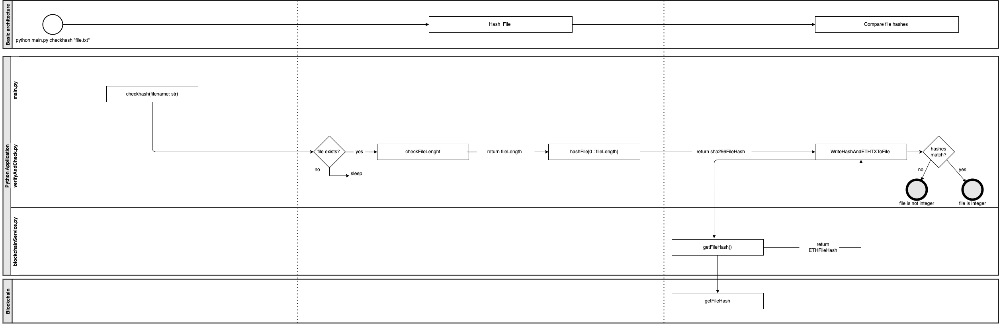

B9FT103 Blockchain & Distributed Ledger Technologies (B9FT103_2122_TMD2)
===========================================

This is a CA2 project for B9FT103. The idea for this project is based on: https://devblogs.microsoft.com/cse/2017/04/10/stampery-blockchain-add-microsoft-office/
The verified smart contract can be found here: https://rinkeby.etherscan.io/address/0xe5fb94959f537b898a7292718c5d18090bcf058a#code

### Running the application: Create .env file at /src
---------------------------
An .env file is needed otherwise the application won’t start. 
The .env file is placed in /src. 
The logic and structure of the .env file is described in the following:

```
RPC_PROVIDER=<https://rinkeby.infura.io/v3/<RPCKey>>
PRIVATE_KEY=<PrivateKey>
```

Now the typer cli can be used:

```
python main.py --help 
```

### Architecture and logic of application
---------------------------
The application consists of two functions: verifyFile and checkFile.
The logic and interaction pattern of the two functions is described in the next two pictures. 

## verifyFile
This function hashes the file and writes the corresponding file hash to the ETH blockchain.


## checkFile
This function hashes the file and compares it to the hash stored in the ETH blockchain.
If the file hash matches the hash stored the file is interger. 
